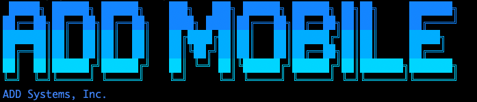

# ADDMOBILE Server Setup Script



## Installation 

Install: Run the following in bash
```
$ bash -c "$(curl -fsSL https://raw.githubusercontent.com/addmobile/setup/refs/heads/main/setup.sh)"
```

That installs the newest published version of both packages. It asks for your registry
credentials, the host port and your gateway URL, then pulls the images and brings up the pod.

### Choosing versions

Two packages are installed from the registry, each named by its own flag:

| Package | Flag | What it is |
|---|---|---|
| `add-mobileportal` | `--add-mobileportal <version>` | the API server |
| `mobileservices` | `--mobileservices <version>` | the auth verify service every gated request is checked against |

Anything not named is installed at its newest published version, which is also what
`--latest` asks for explicitly:

```
# newest of both, stated outright
$ curl -fsSL https://raw.githubusercontent.com/addmobile/setup/refs/heads/main/setup.sh | bash -s -- --latest

# a specific release of one, newest of the other
$ curl -fsSL https://raw.githubusercontent.com/addmobile/setup/refs/heads/main/setup.sh | bash -s -- --add-mobileportal v1.0.0.32

# both pinned
$ curl -fsSL .../setup.sh | bash -s -- --add-mobileportal v1.0.0.32 --mobileservices v0.0.16
```

**Use the piped `| bash -s --` form whenever you are passing anything.** The `bash -c "$(curl
...)"` form at the top cannot carry arguments: with `bash -c SCRIPT word`, `word` becomes the
script's `$0` rather than its first argument, so the installer sees no arguments at all and
quietly does a default install instead of what you asked for.

`setup.sh --help` prints the same summary.

### Stopping the stack

```
$ curl -fsSL https://raw.githubusercontent.com/addmobile/setup/refs/heads/main/setup.sh | bash -s -- down
```

This removes the pod and leaves your data and rendered config in `~/ADD_MOBILE` alone. To remove
the pod *and* clean up its volumes, use the uninstall command below instead. The same `$0` caveat
applies here -- `bash -c "$(curl ...)" down` would reinstall the pod rather than remove it.

### You must put nginx in front of this

The pod listens on plain HTTP and publishes one port. RavenLive and the driver devices are
HTTPS-only, so a host-level nginx terminating TLS for your hostname is **required** -- installer
cannot do this for you.

See **[host-nginx.md](host-nginx.md)** for a reference vhost and the five settings that must be
right. Two of them (the WebSocket upgrade headers, and the upload size limit) fail silently if
wrong: the app appears to work while the live map never updates, or occasional drivers disappear
from the board with no error anywhere.

## Uninstall

This will stop and remove mobile-pod
```
bash -c "$(curl -fsSL https://raw.githubusercontent.com/addmobile/setup/refs/heads/main/clear.sh)"
```

## Optional

Set these in `~/.bashrc` (or `~/.cshrc`, `~/.zshrc`) so the installer does not have to
ask for them:
```
GATEWAY_URL=<your gateway url>
MOBILEAPI_PORT=<host port, default 8080>
```

## What it installs

One podman pod (`mobile-pod`) with four containers: mongodb, mobileservices,
add-mobileportal and nginx. Only nginx is published on the host -- it is the
entrypoint and the auth gate for everything behind it.

A fifth container, kafka, is **off by default**, saving ~1GB of memory and disk
spent on retained events -- only created when `KAFKA_BROKERS` is set.

There is no nginx config to write or keep in step: the installer asks the `add-mobileportal`
image for the gate config that release was built with and fills in the two ports. Reinstalling
at a different version brings that version's config with it.

Health checks once it is up (replace 8080 with your port):
```
curl http://127.0.0.1:8080/health       nginx
curl http://127.0.0.1:8080/ms/health    auth verify
curl http://127.0.0.1:8080/amp/health   the API
```
